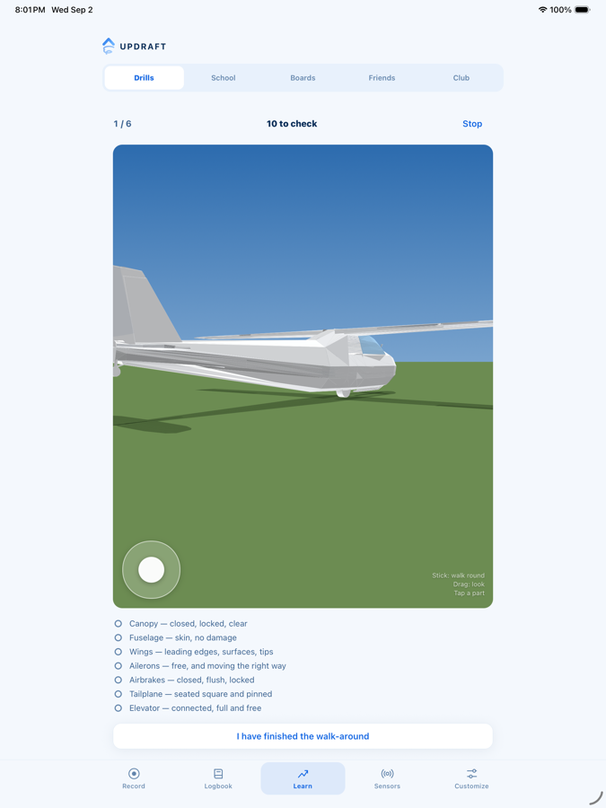

<h1 align="center">Voice Bridge</h1>

<p align="center">
  <b>Talk to your Ray-Ban Meta glasses. Your Mac does the thing.</b><br>
  Voice commands from Meta smart glasses → Claude → actions on your computer.
</p>

<p align="center">
  
  
  
  
  
</p>

<p align="center">
  
</p>

An open-source companion app for the **Meta Wearables Device Access Toolkit
(DAT)**. Hold a button, speak through your glasses, and Claude turns what you
said into a structured command your Mac executes — opening an app, or just
answering the question out loud.

Built because Meta's toolkit gives third-party apps real access to the glasses,
but the `"Hey Meta"` wake word stays private to Meta. This uses an explicit
in-app button instead.

```
Glasses mic (Bluetooth hands-free audio, 8 kHz)
  -> iPhone app turns speech into text, on the device
  -> signed request over your Wi-Fi
  -> Mac listener asks Claude what you meant
  -> Mac runs the action and sends back a sentence
  -> iPhone speaks it through the glasses
```

**No Anthropic API key is needed.** The Mac calls Claude through the Claude Code
CLI, which is logged in with your Claude subscription.

---

## Two things to know before you start

> **If you only read one thing, read this.** It is the answer to the question
> that probably brought you here.

**1. The glasses microphone is not part of Meta's SDK.**
The Device Access Toolkit (DAT) gives you camera, display, and the pairing
session. Microphone and speaker audio arrive as ordinary Bluetooth hands-free
audio, which the app reads with Apple's own AVFoundation. That is why the app
works even before you add the Meta package — you just won't see glasses session
status on screen.

**2. Audio is 8 kHz mono**, the same quality as a phone call. That is fine for
speech-to-text, which is all we use it for.

---

## Get the code

```bash
git clone https://github.com/dogeking69/meta-glasses-voice-bridge.git
cd meta-glasses-voice-bridge
```

`git clone` downloads a copy of this repository; `cd` moves your terminal into
that folder. Every command below is run from there.

---

## Part 1 — Set up the Mac listener

**Step 1. Log in to Claude.** Open Terminal and run:

```bash
claude
```

Follow the login prompt. Your session had expired when this was built, so this
step is required. You only do it once.

**Step 2. Make your config file.** In Terminal:

```bash
cp listener/config.example.toml listener/config.toml
```

`cp` copies a file. `config.toml` is ignored by Git so your secret never gets committed.

**Step 3. Generate a shared secret.** This is a long random password the phone
and the Mac both know, so nothing else on your Wi-Fi can drive your computer:

```bash
python3 -c "import secrets; print(secrets.token_hex(32))"
```

Copy the output, open `listener/config.toml`, and paste it as the value of
`shared_secret`. Keep the terminal window — you need the same value on the phone.

**Step 4. Start the listener:**

```bash
./listener/run.sh
```

It prints the address your phone should use, like `http://192.168.1.173:8765`.
Leave this window open; `Ctrl+C` stops it.

---

## Part 2 — Set up the iPhone app

**Step 1.** Open `ios/VoiceBridge.xcodeproj` in Xcode.

**Step 2. Set your signing details.** Apple requires the app be signed with your
own developer identity before it can install on a phone. Copy the example file:

```bash
cp ios/Local.xcconfig.example ios/Local.xcconfig
```

Open `ios/Local.xcconfig` and set both values. Your Team ID is in Xcode under
**Settings → Accounts → your Apple ID → Team**. The bundle identifier can be
anything unique, like `com.yourname.voicebridge`. This file is gitignored, so
your details never get committed.

**Step 3.** Plug in your iPhone, pick it in the device menu at the top, press
the ▶ Run button.

**Step 4.** The app opens its Settings screen on first launch. Enter the address
the listener printed, and paste the same shared secret. Tap **Test connection**
— it should say "Reached your Mac." The secret is stored in the iPhone Keychain.

**Step 5.** Put on the glasses, make sure they are connected to the phone over
Bluetooth, then hold the big microphone button and speak. Let go when done.

The **Microphone** row on the main screen turns green only when audio is really
coming from the glasses rather than the iPhone. If it stays grey, the glasses are
not connected over Bluetooth.

---

## Part 3 — Connect the glasses to the Meta toolkit (optional)

**The glasses microphone works without any of this.** Audio arrives as ordinary
Bluetooth hands-free audio, so voice commands work with the toolkit unconfigured.
This section only adds registration and session status to the Glasses row.

`MWDATCore` 0.9.0 is already a dependency of the Xcode project — Swift Package
Manager fetches it on first build, nothing to add. What is missing is your own
Meta credentials:

1. **Enable Developer Mode on the glasses**, in the Meta AI app's settings. You
   need Meta AI app v247 or newer and glasses firmware v20 or newer.
2. Register at the [Wearables Developer Center](https://wearables.developer.meta.com)
   and create a project. You get a **Meta App ID** and a **Client Token**.
3. Put them in `ios/Local.xcconfig`, **not** in `Info.plist`:

   ```
   META_APP_ID = your-app-id
   META_CLIENT_TOKEN = your-client-token
   ```

   `Info.plist` reads them as build variables, so the committed file stays free
   of credentials and `Local.xcconfig` is gitignored. A client token is not as
   sensitive as an app secret, but it still identifies your app and does not
   belong in a public repository.
4. In the Wearables Developer Center, register the bundle identifier you build
   with and the `voicebridge://` URL scheme, or registration will be rejected.
5. Rebuild. A **Connect glasses** button appears; tapping it hands off to the
   Meta AI app for approval and returns you here.

Until step 3 is done the Glasses row reads "Meta AI app unavailable", because
`Wearables.configure()` cannot attest an app with a placeholder App ID.

**A note on SDK versions.** The dependency is pinned to exactly 0.9.0 rather
than a range. This is a developer preview and it makes breaking changes between
minor versions — `DeviceState.batteryLevel` existed in 0.2 and was gone by 0.8 —
so an open range would break the build without warning. Also be careful with the
published API reference: at 0.9.0 `startRegistration()` and `handleUrl(_:)` are
`async throws` and `createSession(deviceSelector:)` throws, which the docs pages
do not show. The `.swiftinterface` inside the xcframework is the real contract.

**Live SDK docs.** Meta runs a documentation server you can connect to Claude
Code so DAT questions get answered from current docs instead of guesswork. Run
this in a Terminal (not in this app):

```bash
claude mcp add --transport http meta-wearables https://mcp.developer.meta.com/wearables
```

Then in a `claude` session you can use `search_dat_docs`.

---

## The actions it can do

Defined in `listener/actions.py`. Only these two exist on purpose — a bad
transcription can never run a command that is not listed here.

| You say | What happens |
|---|---|
| "how far away is the moon" | Claude answers out loud. |
| "and what about the sun" | Follow-ups work — recent turns are given back to Claude as context. |
| "open spotify" | Opens an app. Only apps under `[actions.open_app]` in `config.toml`. |
| "turn the volume up", "pause the music", "lock the screen" | Controls the Mac. |
| "make a note that…" | Appends to `~/Documents/voice-notes.md`. |
| "remind me to…" | Adds to the Mac's Reminders app. |
| "what time is it", "what's my battery", "what's playing", "what's next on my calendar" | Reads live state off the Mac. |
| "look up …" | Opens a web search on the Mac. |
| "set a timer for ten minutes" | Counts down and notifies on the Mac. |
| "copy hello world to my clipboard", "what's on my clipboard" | Reads and writes the Mac clipboard. |
| "text mom saying I'll be late" | Sends an iMessage. **Confirmed out loud first.** |
| "continue working on apex sky" | Runs Claude Code in that project. **Confirmed out loud first** — see below. |

## Context

The listener keeps a rolling conversation log and feeds the last few turns back
to Claude, so pronouns and follow-ups resolve against what was actually said:

> **You:** "how far away is the moon" — *"About 239,000 miles on average."*
> **You:** "and what about the sun" — *"About 93 million miles."*
> **You:** "what did I just ask you to write down" — *"You asked me to note that…"*

Depth is `context_turns` in `config.toml`. History lives in `listener/history.json`,
which is gitignored — it is a record of everything you have said.

## The app

One screen, built like a modern AI chat app. The conversation is the interface.

- **Type or talk.** A text field for when speaking is awkward, and a hold-to-talk
  microphone next to it. Both go through exactly the same path.
- **Suggestions** on an empty conversation, tappable to run.
- **Action badges** under each reply say what actually ran — `set timer`,
  `open app`, `take note` — so you can see it did the thing rather than just
  talked about it.
- **Confirmations** appear inline in orange with Confirm and Cancel buttons, or
  you can just say yes.
- **Status strip** at the top: which microphone is live, whether the Mac is
  reachable, whether hands-free is listening. Tap to expand for detail.
- **Long-press a message** to copy it, or "Say again" to re-run a command.
- **Haptics** on send, success and failure, because the phone is usually in a
  pocket.

History comes from the listener, not the phone, so it survives reinstalls and
reflects what actually ran. The compose button clears both the conversation and
the context Claude sees.

To allow another app, add a line to `[actions.open_app]` in `config.toml`:
`slack = "Slack"` — the left side is what you say, the right side is the real
app name. Restart the listener afterwards.

To add a genuinely new kind of action, you edit two places: describe it in the
prompt in `listener/claude_client.py`, and implement it in `listener/actions.py`.

---

## Say-yes-first confirmation

Anything listed under `[confirm] require` in `config.toml` is never run straight
off a transcription. Instead the Mac reads back exactly what it is about to do:

> *"About to run Claude Code in apex-sky, with the instruction: continue the work
> in progress on this project. Say yes to run it, no to cancel, or say what to
> change."*

You then hold the button and say one of:

- **"yes"** (or yeah, go ahead, do it) — it runs.
- **"no"** (or cancel, never mind, stop) — it is dropped.
- **anything else** — treated as a correction. The Mac re-plans and reads the new
  version back for approval. Nothing runs until you actually say yes.

Or tap **Confirm** / **Cancel** on screen if speaking is awkward.

The read-back sentence is built by the listener from the *resolved* action and
its real target folder, not from Claude's own description, so what you hear is
always what will actually run. The parser is deliberately strict: only a short,
unambiguous phrase counts as yes or no. Something like *"no, use the other
project"* is an edit, not a cancel — the failure direction is always "ask again",
never "run it anyway". Each confirmation token works once and expires after three
minutes.

---

## Using it away from home

The listener is local-network only. To reach your Mac from anywhere, use
[Tailscale](https://tailscale.com) — it is free for personal use, encrypted, and
needs no port forwarding.

1. Install Tailscale on your Mac and your iPhone, and sign in to the same account
   on both.
2. On the Mac, run `tailscale ip -4` to get its Tailscale address (starts `100.`).
3. Put that address in the app's Settings instead of your home IP. It works on
   your home Wi-Fi and on cellular alike.

Do **not** port-forward the listener to the public internet instead. A shared
secret is enough for your own LAN and for Tailscale's private network; it is not
enough to sit exposed on the open internet.

## Hands-free mode

There is no way for a third-party app to hook the "Hey Meta" wake word — Meta
does not expose it, and no code here can change that. So the app has its own.

**One squeeze of the Action Button starts a listening session.** After that you
are hands-free until you squeeze again: say your wake phrase, then your command,
as many times as you like.

Set it up once: **Settings → Action Button** → swipe to **Shortcut** → pick
**Toggle Voice Bridge Listening**. It also works from Siri ("Hey Siri, toggle
Voice Bridge") and from Back Tap (Settings → Accessibility → Touch → Back Tap).

### What you hear

Hands-free mode is audible, so you never need to look at the phone:

| Sound | Meaning |
|---|---|
| Rising two-tone | Session started — it is listening for the wake phrase |
| Record-start beep | Wake phrase heard — say your command now |
| Record-stop beep | Command captured, sending to your Mac |
| Falling two-tone | Session stopped |

A notification also sits in Notification Centre for as long as the session runs,
showing elapsed time, which microphone is in use, and your iPhone battery.

### The wake phrase

Default is **"hey jarvis"**, editable in the app's Settings. Two distinct words
work best. The glasses microphone is 8 kHz, so matching is fuzzy — "hey jarvas"
and "hey jervis" both count — but single common words like "computer" will
misfire during ordinary conversation.

After the Mac reads back a confirmation, you do **not** need the wake phrase
again; just say yes, no, or what to change within 30 seconds.

### Why a session and not always-on

Holding the Bluetooth hands-free link open keeps the glasses in call mode, which
drains them roughly twice as fast as normal use and blocks music. A session you
switch on for a few minutes costs little. Leaving it on all day would not.

### What is not shown, and why

The glasses battery percentage. `DeviceState.batteryLevel` existed in Device
Access Toolkit v0.2 but was **removed by v0.8**; the current struct exposes only
`thermalLevel`, and battery appears nowhere in the toolkit docs. The notification
shows elapsed listening time instead, which is what actually predicts the drain.

---

## Security

- Every request is signed with HMAC-SHA256 over `<timestamp>.<body>`. Wrong
  secret, no signature, or a request older than 60 seconds is rejected.
- The listener binds to your local network only. Nothing is exposed to the
  internet, and you should not port-forward it — the shared secret alone is not
  enough protection for a public endpoint.
- The shared secret lives in `config.toml` (gitignored) on the Mac and in the
  Keychain on the phone. It is never in source code.
- The app sets `NSAllowsArbitraryLoads` because the listener is plain HTTP on a
  private address, and iOS blocks that by default. `NSAllowsLocalNetworking`
  alone is not enough — it exempts only `.local` hostnames and link-local
  addresses, not `192.168.x.x` or a Tailscale `100.x` address. The app only ever
  talks to the single host you configure, every request is HMAC-signed, and over
  Tailscale the traffic sits inside a WireGuard tunnel, so it is encrypted on the
  wire despite being HTTP.

  **`NSAllowsArbitraryLoads` must be the only key in that dictionary.** Apple
  ignores it completely if `NSAllowsArbitraryLoadsInWebContent`,
  `NSAllowsArbitraryLoadsForMedia` or `NSAllowsLocalNetworking` is also present.
  Adding one of those narrower-looking keys silently disables the exemption and
  every request fails with "the App Transport Security policy requires the use of
  a secure connection" — with nothing in the build output to hint at why.
- Speech-to-text runs on the iPhone, so your audio is not uploaded anywhere.
- Voice-triggered coding work is limited to folders you list in `config.toml`. A
  misheard project name is refused, not guessed at. Inside those folders Claude
  Code may read, edit and run commands, but `git push`, `rm` and `sudo` are
  blocked by `disallowed_tools`.

---

## If something goes wrong

| Symptom | Fix |
|---|---|
| "Claude CLI is not logged in" | Run `claude` in a Terminal and log in. |
| "Bad signature" | The secret in the app and in `config.toml` do not match exactly. Watch for trailing spaces. |
| "No answer" on Test connection | Listener not running, or phone and Mac are on different Wi-Fi networks. |
| Microphone row stays grey | Glasses are not connected over Bluetooth, or another app is holding the mic. |
| "Address already in use" | The listener is already running in another Terminal window. |

---

## Files

```
ios/VoiceBridge/
  VoiceBridgeApp.swift   app entry, Meta toolkit setup, registration callback
  ContentView.swift      hosts the chat screen
  ChatScreen.swift       the whole interface
  ChatModel.swift        conversation state and the round trip to the Mac
  Message.swift          message model and action icons
  MessageRow.swift       bubbles, action badges, thinking indicator
  Haptics.swift          physical feedback
  SettingsView.swift     Mac address, shared secret, wake phrase
  VoiceCapture.swift     Bluetooth audio routing + on-device speech-to-text
  GlassesManager.swift   Meta toolkit registration and session
  ListenerClient.swift   signed requests to the Mac
  Speaker.swift          reads replies aloud
  SpokenDecision.swift   parses a spoken yes / no / correction
  WakeWord.swift         fuzzy wake-phrase matching for 8 kHz audio
  ListeningSession.swift hands-free state machine
  ListeningNotification.swift  the "listening" banner
  ToggleListeningIntent.swift  Action Button / Siri / Shortcuts entry point
  Chime.swift            audible cues
  SettingsStore.swift    saved settings
  Keychain.swift         secret storage

listener/
  server.py              the local server, signature checking, confirmations
  claude_client.py       runs the Claude Code CLI, parses its JSON
  actions.py             the allowed actions, and how they are described aloud
  mac_actions.py         Mac control: volume, notes, reminders, timers,
                         clipboard, messages, status, search
  conversation.py        rolling history, and the context fed back to Claude
  pending.py             actions parked waiting for you to say yes
  config.example.toml    template for your config.toml
  run.sh                 starts the listener
```

---

## Contributing

Issues and pull requests are welcome — especially:

- More actions in `listener/actions.py` (media control, window management, notes)
- A Linux or Windows version of the listener
- Better handling of the 8 kHz audio for accuracy

Keep the security model intact: new actions must be explicitly allowlisted, never
constructed from free text.

## Credits and related links

- [Meta Wearables Device Access Toolkit for iOS](https://github.com/facebook/meta-wearables-dat-ios)
- [Wearables Developer Center](https://wearables.developer.meta.com)
- [Claude Code](https://claude.com/claude-code)

## License

MIT — see [LICENSE](LICENSE).
